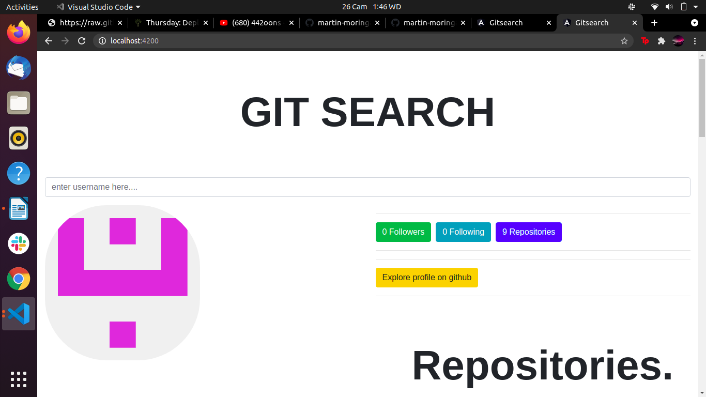

## Author Martin Mylles, May 21st 2021

## Description
An angular application that allows user to search for their git hub accounts.After inputing the desired name being looked for through the given form,the app outputs the users github information.

## Screenshot

## Behaviour Driven Development(BDD)
The website has the following functionalities:

* The user can be able to input their name through the given form
* On submitting the form,the user gets their github information outputted.
* On pressing either user or repositories in the navbar,the corresponding informaion is dispalyed accordingly.

## Setup/Installation requirements
Clone or download and unzip the repository from github, https://github.com/martin-moringa/angular2.git. If you have git Use this command git clone  to clone the project. Run ng serve from your terminal Live Demo

To view the page click on the link below

## Development server
Run ng serve for a dev server. Navigate to http://localhost:4200/. The app will automatically reload if you change any of the source files.

## Build
Run ng build to build the project. The build artifacts will be stored in the dist/ directory. Use the --prod flag for a production build.

## Technologies Used
* Angular CLI
* Html
* CSS
* Bootstrap

## Known Bugs
The application does not display the list of repositories as expected.

## Support and Contact Details
For any comments,suggestions,feedback or inquiries, contact me via email: martin.mylles@student.moringaschool.com

Make contributions to the code.

## License
This project is licensed under the MIT Open Source license Copyright &copy; 2021. Martin Mylles
